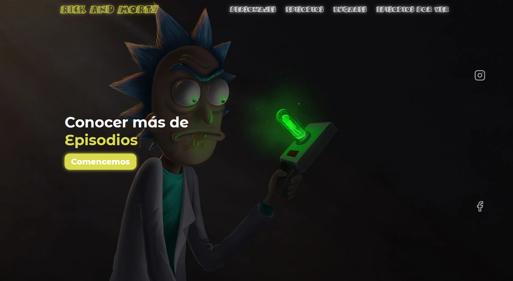

<h1 align="center">
   
  
   
  Rick and Morty
   
  <h4 align="center">Rick and Morty page usando <a href="https://uk.reactjs.org/" target="_blank">React.js</a>
</h1>

 
Hola, soy <str>Gonzalo Cuellar<str> y estoy presentando mi proyecto de Rick & Monty.
he usado distintas tecnologias.
voy a seguir exlicando mi proyecto dependiendo los cambios que vaya haciendo.
muchas gracias por estar aqui!!!!